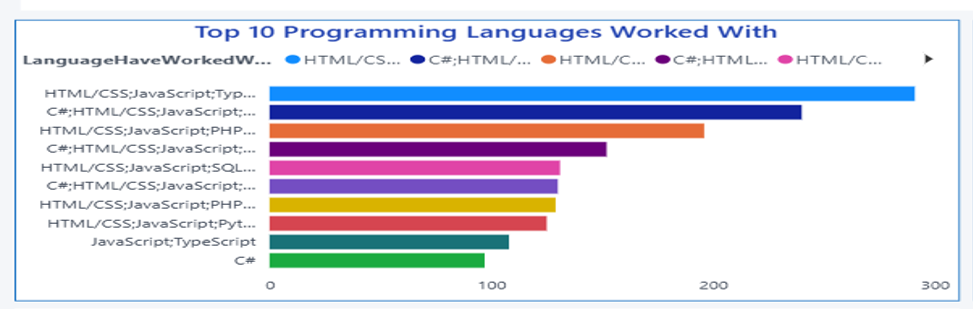
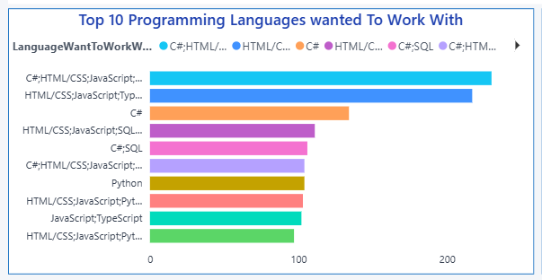
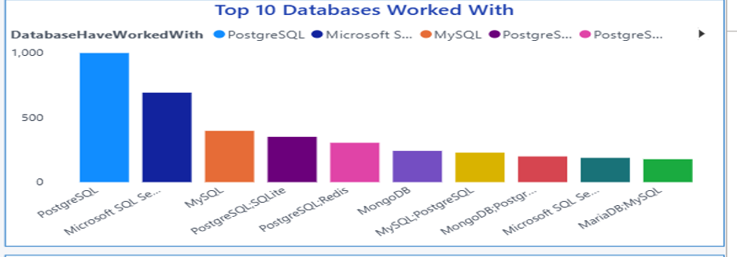
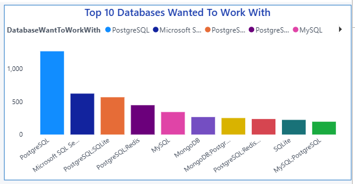
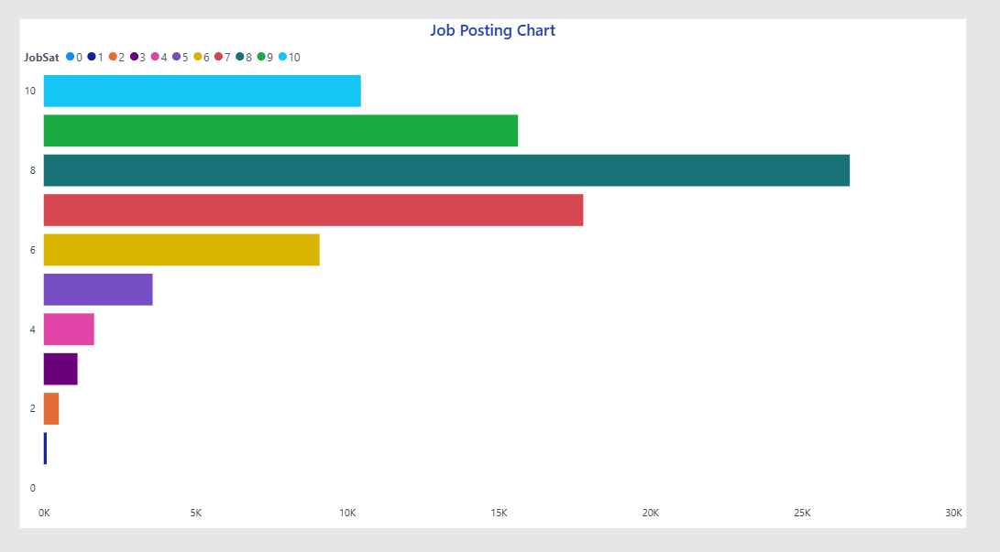
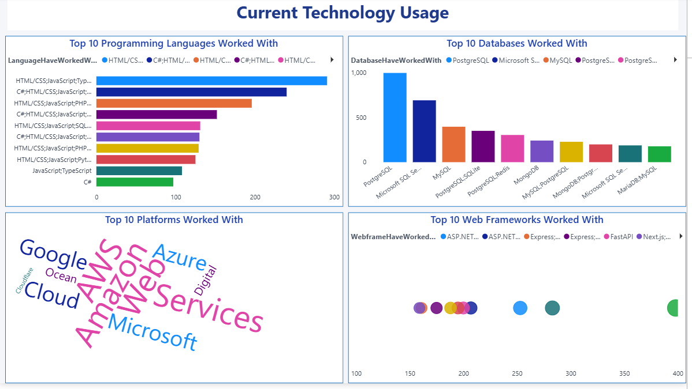
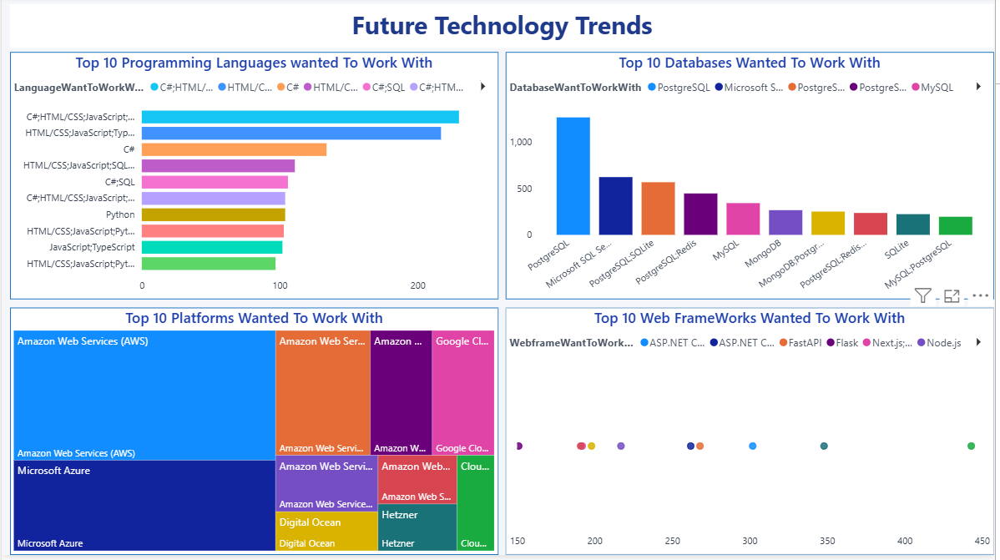
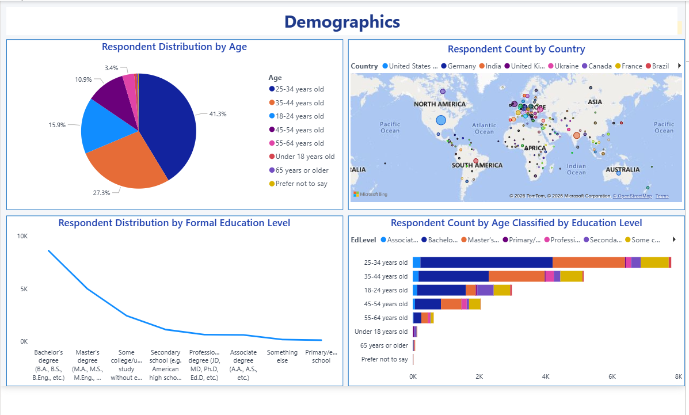

# Stack Overflow Developer Survey Analysis

---

## Table of Contents

- [Executive Summary](#executive-overview)
- [Introduction](#introduction)
- [Methodology](#methodology)
- [Programming Language Trends](#programming-language-trends)
- [Database Trends](#database-trends)
- [Job Market Analysis](#job-market-analysis)
- [Dashboard Insights](#dashboard-insights)
- [Overall Findings](#overall-findings)
- [Conclusion](#conclusion)
- [Author](#author)

---

## Executive Summary

**JavaScript, HTML/CSS and C#** dominate current usage.

**PostgreSQL** is the most popular and most desired database.

**AWS and Azure** lead cloud platform usage.

**Mid-career professionals (30-45)** earn highest median compensation.

**Job satisfaction** peaks at **level 8**.

Strong correlation between experience and compensation.

---

##  Introduction

The purpose of this analysis is to understand the global developer landscape.

This dataset contains responses from thousands of developers across different countries, age groups, and employment types.

**This analysis helps:**

Which technologies are trending?

What skills should developers learn?

How does compensation vary?

What affects job satisfaction?

**This analysis is useful for:**

Hiring managers planning recruitment.

Developers planning career growth.

Organizations planning tech investments.

---

## Methodology

**Data Source:**

Stack Overflow Developer Survey Dataset

**Data Cleaning Steps Performed:**

Removed missing values

Imputed numerical columns using median

Imputed categorical columns using mode

Removed compensation outliers (IQR method)

Converted Age and YearsCodePro to numeric

Created age groups

Log transformed compensation

**Tools Used:**

Python(Pandas, Numpy, Matplotlib, Seaborn) & Power BI

---

## Programming Language Trends

### Current Programming Language Trends

In this analysis, I examined the most commonly used programming languages among developers.

**JavaScript ranks highest.**

**HTML/CSS** closely follows.

**C#, Python, and TypeScript** show strong adoption.

Multi-language usage is common.

JavaScript’s dominance confirms that web development continues to lead the global software market.

TypeScript’s strong position suggests a shift toward scalable and maintainable front-end development.

Python’s presence indicates its importance in data science, automation, and AI.

---

### Future Programming Language Trends

This chart highlights the technologies developers are interested in learning next year.

**Insights:**

**JavaScript** remains strong.

**Python** interest is growing.

**TypeScript** continues to rise.

**Modern ecosystems** dominate preferences.

There is strong overlap between current usage and future interest, indicating stability in core technologies.

However, emerging languages show increased curiosity, suggesting innovation-driven learning.

---

## Database Trends

### Current Database Trends

This chart analyzes the most commonly used databases.

**Observations:**

**PostgreSQL** leads.

**MySQL and SQL Server** remain widely used.

MongoDB represents NoSQL adoption.

Redis show caching and performance focus.

**PostgreSQL** is a safe long-term skill investment.

Organizations still rely heavily on structured relational systems.

---

### Future Database Trends

This chart reflects developer interest in future database technologies.

**Insights:**

**PostgreSQL** maintains top position.

**Redis** demand increasing.

**MongoDB** interest rising.

**Traditional SQL** databases still stable.

**PostgreSQL** appears in both **current and future charts**, indicating sustained dominance.

This suggests market maturity rather than rapid disruption.

---

## Job Market Analysis

This chart represents the distribution of job satisfaction levels among respondents.

**Observations:**

**Satisfaction level 8** is most frequent.

Very low satisfaction levels are limited.

Majority fall between 6-8 range.

The developer workforce appears moderately to highly satisfied overall.

Extreme dissatisfaction is rare, which indicates relatively stable working conditions in tech.

---

## Dashboard Insights

### Dashboard 1: Current Technology Usage

This dashboard consolidates the current technology ecosystem across programming languages, databases, and platforms.

**Highlights:**

**JavaScript** dominates language usage.

**PostgreSQL** leads database adoption.

**AWS** is the most widely used cloud platform.

Full-time employment dominates respondents.

The ecosystem strongly revolves around web-first, cloud-integrated architectures.

This suggests that modern development is centered around scalable web applications.

Organizations must prioritize cloud-native development.

Hiring demand will continue in JavaScript & PostgreSQL stacks.

---

### Dashboard 2: Future Technology Trends

This dashboard captures technologies developers want to work with in the future.

**Observations:**

**PostgreSQL** remains dominant.

**Redis and MongoDB** interest increasing.

**TypeScript and Python** gaining traction.

Cloud platforms maintain strong demand.

There is strong overlap between current usage and future preference, indicating market stability.

At the same time, growing interest in modern tools suggests gradual innovation.

Organizations adopting trending technologies will attract talent.

Developers aligning with future-demand stacks improve career growth.

---

### Dashboard 3: Demographics

This dashboard summarizes age distribution, education level, and employment type.

**Insights:**

Majority age group **25-34**.

Most developers hold Bachelor’s degrees.

**Full-time employment** dominates.

**USA, India, Germany** among top respondent countries.

The global tech workforce is young, educated, and largely employed in stable roles.

---

## Overall Findings

This analysis reveals a stable yet evolving developer ecosystem characterized by:

**Dominance of web and cloud technologies.**

**Strong compensation growth with experience.**

**High employability across regions.**

Moderate to high job satisfaction levels.

Technology markets show incremental innovation rather than disruptive shifts.

**For Companies:**

Invest in cloud-native architecture.

Focus on PostgreSQL and modern web stacks.

Create mid-career growth paths.

Offer continuous learning programs.

**For Developers:**

Build expertise in JavaScript ecosystem.

Learn PostgreSQL and cloud integration.

Gain 5-10 years of focused experience for strong salary growth.

Develop multi skill capability.

## Conclusion

The Stack Overflow Developer Survey data provides valuable insights into global developer trends.

Organizations that invest in cloud technologies, modern databases, and continuous talent development will remain competitive.

For developers, focusing on high-demand stacks and accumulating professional experience significantly improves earning potential.
